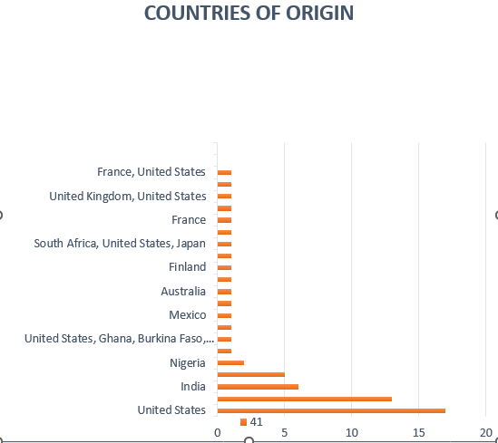
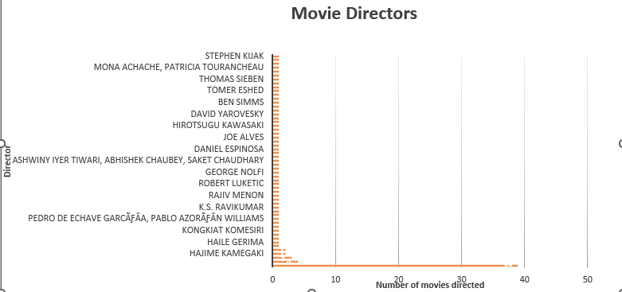
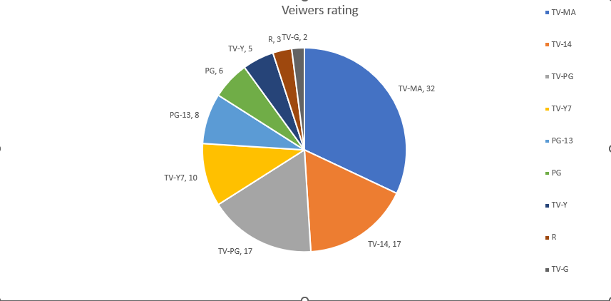

**content amangement system
**

AIM: To develope a catalogue for moviess based on varipus grouping susch as , rating , country and number pf views. 


#netflix_data
**CATALOG FOR NETFLIX MOVIES**


_For this project I grouped the netflix data according to rating, the_ _country of production and number of previews._
_Grouping data in designing a  suitable catalog that is properly aquinted with the  organization of it's data._


*_Grouping according to countries_*
 

```sql
select  country, count(*)
from netflix_titles
group by  country
order  by count(*) desc
```
1. Data collected ffrom the netflix movies indicates that a good number of the movies are produced in North and South america.


*_Grouping accorfding to directors_*

```sql
select   director, count(*) as director
 from netflix_titles
 group by director
 order by count(*) desc
```


*_Grouping according to Viewers rating_*

```sql
 select rating,   count(*)  
 from netflix_titles
 group by rating
order by count(*) desc

```


# netlix_data
